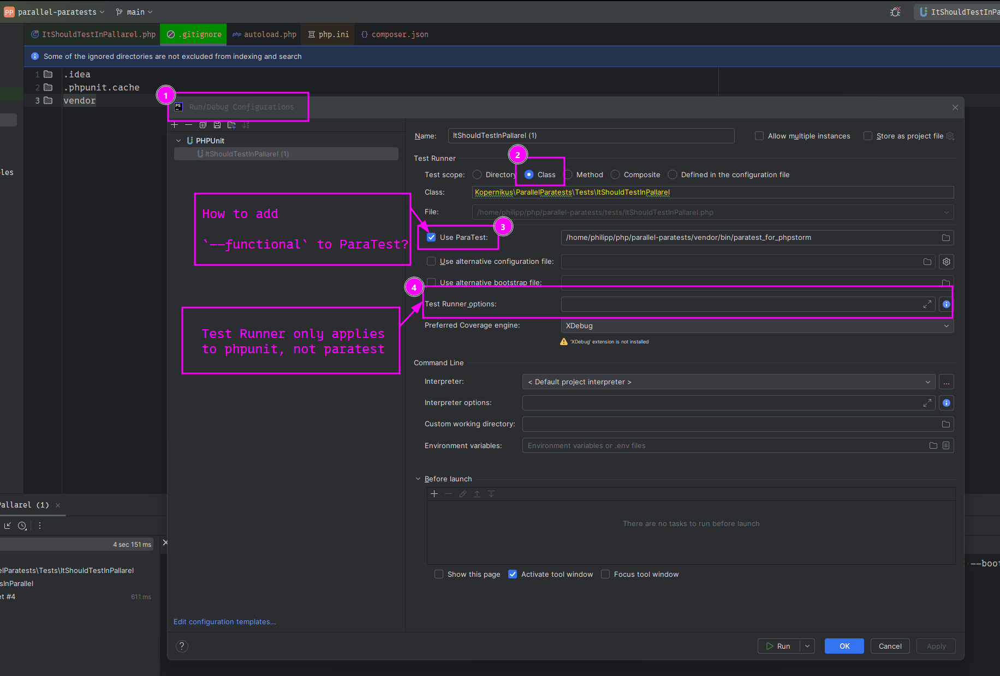

# Paratest Parallel Test Execution within same class

paratest allows `--functional` to enable parallel test execution.

This works from a normal terminal:

```shell
composer run-script tests:parallel
> bash -c "shopt -s globstar; paratest ./tests/**/*.php --functional"
ParaTest v7.12.0 upon PHPUnit 12.3.8 by Sebastian Bergmann and contributors.

    Processes:     32
Runtime:       PHP 8.4.12

..........                                                        10 / 10 (100%)

Time: 00:01.251, Memory: 10.00 MB

OK (10 tests, 10 assertions)
```

Yet what is the way to set in phpstorm run config?



Asked this question on:

- [Stackoverlfow question](https://stackoverflow.com/questions/79756870/how-to-run-tests-of-the-same-phpunit-testcase-class-in-parallel-with-paratest)
- [paratest github issue](https://github.com/paratestphp/paratest/issues/1011)